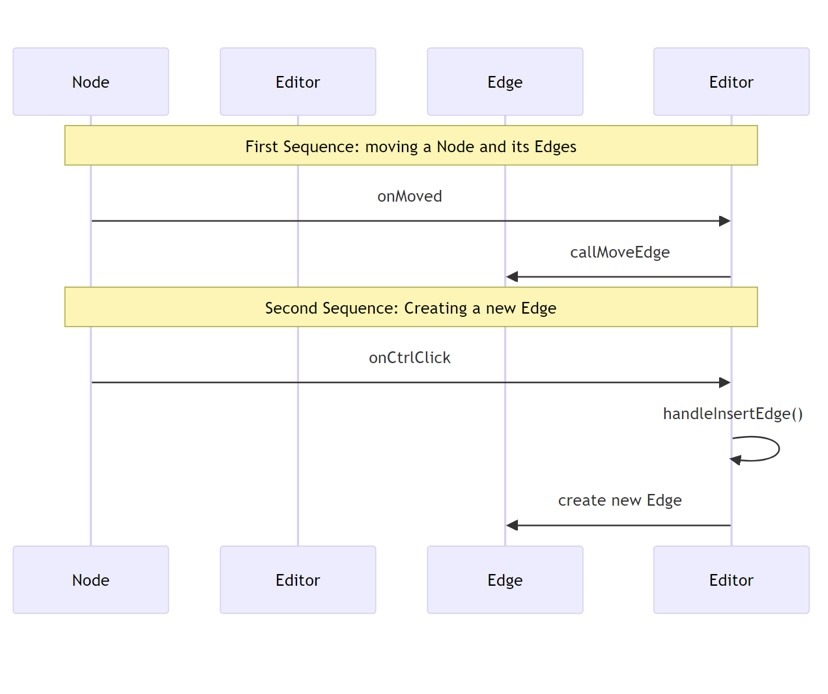

# Gerador de Grafos com Exportação para LaTeX

# Escopo
O projeto consiste em uma aplicação (web/multi-plataforma) para a geração de grafos a partir da entrada do usuário, com a possibilidade de exportação de código ```LaTeX``` e de imagem em formato ```.png```. Além da geração a partir da entrada manual, o usuário pode selecionar grafos predefinidos (ex.: grafo completo com N vértices, grafo bipartido, etc.).

### Features do Sistema

- [ ] O usuário deve ser capaz de adicionar um grafo (em linguagem matemática ou com ferramenta gráfica da interface)
- [ ] O usuário deve poder, durante a seleção, definir se o grafo é direcionado ou não
- [ ] O usuário deve ser capaz de selecionar um grafo dentre uma coleção de grafos predefinidos
- [ ] O usuário, após selecionar ou adicionar um grafo, deve ser capaz de editá-lo, adicionando/removendo vértices e arestas
- [ ] O usuário deve poder editar as cores de cada vértice
- [ ] O usuário deve ser capaz de exportar o grafo gerado em formato ```.png```
- [ ] O usuário deve ter acesso ao código ```LaTeX``` do grafo gerado pelo sistema
- [ ] O usuário deve ser capaz de acessar o histórico de grafos gerados anteriormente, bem como de seus códigos ```LaTeX```
- [ ] O usuário deve ser capaz de criar uma conta (com email e senha) a fim de salvar o conteúdo gerado
- [ ] O usuário deve poder acessar as funcionalidades do sistema a partir de múltiplos dispositivos, mediante criação de conta e autenticação prévia

### Membros da Equipe

- Bruno Oliveira [@brunooss](https://github.com/brunooss): desenvolvedor _full-stack_
- Laila Melo [@lailamvl](https://github.com/lailamvl): desenvolvedora _full-stack_
- Thiago [@trassis](https://github.com/trassis): desenvolvedor _full-stack_
- 

### Tecnologias

O sistema contará com uma interface web/mobile, que será desenvolvida com _React_ e _Typescript_, além de um backend _serverless_ baseado em _Node.js_ servido pelo _Firebase Functions_ e um bando de dados NoSQL hospedado em nuvem servido pelo _Firebase Firestore_.

### Backlog do Produto
- [ ] Como usuário, eu gostaria de ser capaz de criar uma conta com email e senha
- [ ] Como usuário, eu gostaria de adicionar um grafo no sistema
- [ ] Como usuário, eu gostaria de selecionar um grafo entre um conjunto de grafos pré-definidos
- [ ] Como usuário, eu gostaria de alterar a quantidade de vértices e arestas do meu grafo
- [ ] Como usuário, eu gostaria de alterar a cor dos vértices do meu grafo
- [ ] Como usuário, eu gostaria de poder tornar meu grafo direcionado ou não
- [ ] Como usuário, eu gostaria de poder acessar o código '''LaTex''' do meu grafo
- [ ] Como usuário, eu gostaria de poder exportar o grafo criado em formato '''.png'''
- [ ] Como usuário, eu gostaria de poder adicionar um grafo nos favoritos
- [ ] Como usuário, eu gostaria de ter acesso aos meus grafos criados recentemente
- [ ] Como usuário, eu gostaria de poder acessar o sitema em múltiplos dispositivos

### Backlog da Sprint

- [ ] História 0: Setup Inicial
    - Setup do projeto com Vite e MUI
    - Setup do projeto no Firebase (Authentication & Firestore Database)
    - Instalar biblioteca _Cytoscape.js_ para edição de grafos
      
- [ ] História 1: Como usuário, eu gostaria de ser capaz de criar uma conta com email e senha
    - Criar tela de login [Laila]
    - Criar tela de criação de conta [Laila]
    - Criar tela de trocar senha [Bruno]
    - Integrar páginas de autenticação com _Firebase Authentication_ [Bruno]

- [ ] História 2: Como usuário, eu gostaria de adicionar um grafo no sistema
    - Criação de página inicial com MUI [Bruno]
    - Setup do editor visual com biblioteca _Cytoscape.js_ [Bruno]
    - Botões na interface para criação de (grafo completo e grafo vazio) [Laila]
    - Desenhar grafo novo em editor visual a partir de input de uma lista de adjacência [Thiago]

- [ ] História 3: Como usuário, eu gostaria de alterar a quantidade de vértices e arestas do meu grafo
    - Adicionar interação para criar novos vértices e arestas (clique com botão direito ou apertar e segurar) [Bruno]
    - Adicionar novos elementos nas informações da definição do grafo (vértices e arestas) [Thiago]
    - Atualizar o código 'LaTeX' gerado executando a função novamente [Laila]

- [ ] História 4: Como usuário, eu gostaria de acessar o código `LaTeX` do meu grafo.
    - Criar aba _'Código'_ para visualização do código `LaTeX` [Laila]
    - Criar modelos padrão a serem exibidos no editor de grafos disponíveis no `LaTeX` [Laila]
    - Fazer função que recebe informações de grafo construído em editor (coordenadas de vértices, cores, arestas) e gera código `LaTeX` [Thiago]
    - Adicionar botão para exportar o código ou imagem .png [Bruno]

  ### Diagramas


    
    
